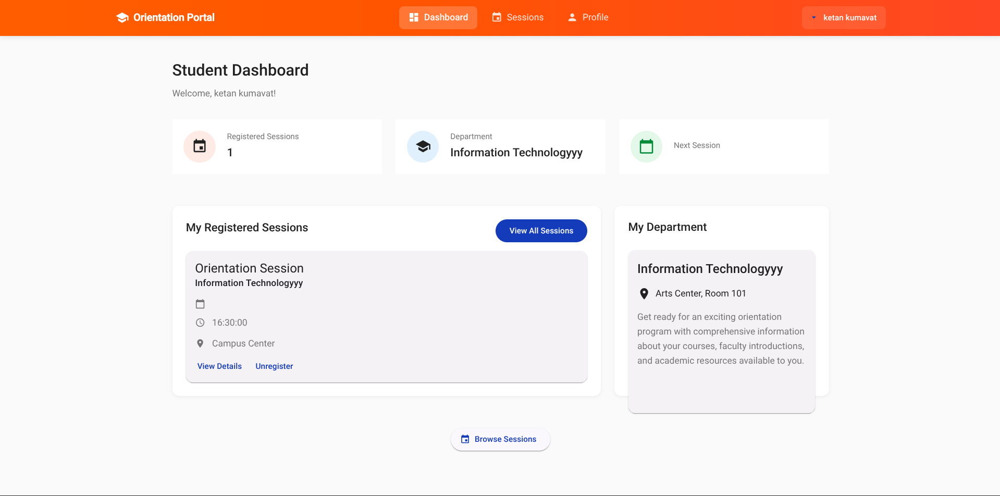
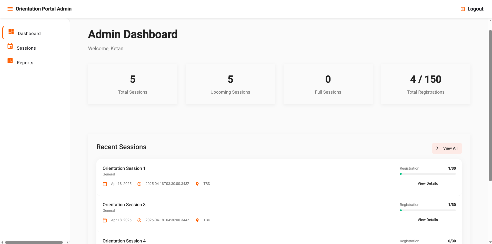
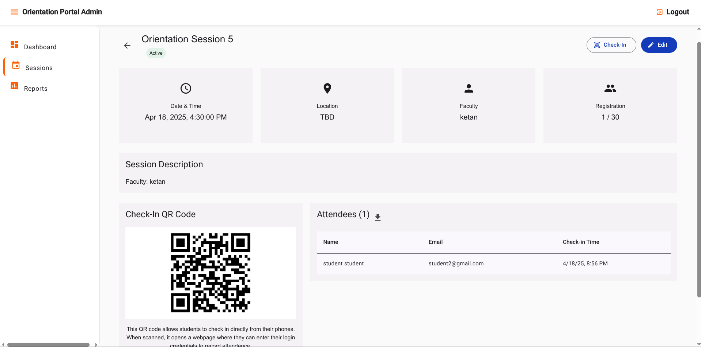
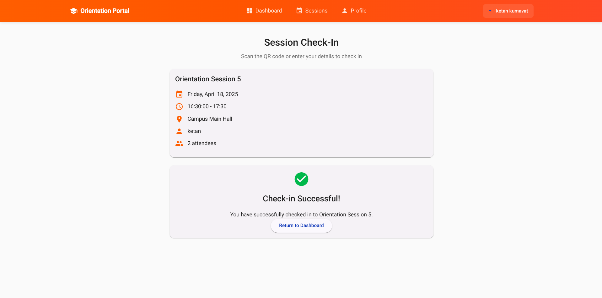

# Orientation Session Manager - Frontend

A modern web application for managing university orientation sessions, attendance tracking, and student check-ins using QR codes.

## Features

- **User Authentication**: Secure login and registration system with role-based access control
- **QR Code Check-in**: Scan QR codes to quickly check into orientation sessions
- **Admin Dashboard**: Manage orientation sessions, track attendance, and generate reports
- **Student Portal**: View upcoming orientation sessions and attendance history
- **Mobile Responsive**: Fully responsive design works on desktop and mobile devices
- **Real-time Updates**: Instant attendance tracking and session management

## Technologies Used

- **Angular 17**: Frontend framework
- **Angular Material**: UI component library
- **RxJS**: Reactive programming
- **TypeScript**: Static typing for robust code
- **JWT Authentication**: Secure token-based authentication
- **Responsive Design**: Mobile-first approach

## Getting Started

### Prerequisites

- Node.js (v16+)
- npm (v8+)
- Angular CLI (`npm install -g @angular/cli`)

### Installation

1. Clone the repository:

   ```bash
   git clone https://github.com/yourusername/orientation-app.git
   cd orientation-app/frontend
   ```

2. Install dependencies:

   ```bash
   npm install
   ```

3. Start development server:

   ```bash
   npm start
   ```

4. Open your browser and navigate to `http://localhost:4200`

## Project Structure

```
frontend/
├── src/
│   ├── app/
│   │   ├── admin/             # Admin module
│   │   ├── auth/              # Authentication module
│   │   ├── core/              # Core services and models
│   │   ├── shared/            # Shared components and utilities
│   │   └── students/          # Student module
│   ├── assets/                # Static assets
│   └── environments/          # Environment configuration
├── .env                       # Environment variables
└── README.md                  # This file
```

## User Roles

- **Admin**: Create and manage orientation sessions, view attendance
- **Student**: View and check-in to orientation sessions

## Screenshots

### Student Dashboard



### Admin Dashboard



### QR Code Scanning



### Session Check-in



## Contributing

1. Fork the project
2. Create your feature branch (`git checkout -b feature/amazing-feature`)
3. Commit your changes (`git commit -m 'Add some amazing feature'`)
4. Push to the branch (`git push origin feature/amazing-feature`)
5. Open a Pull Request
